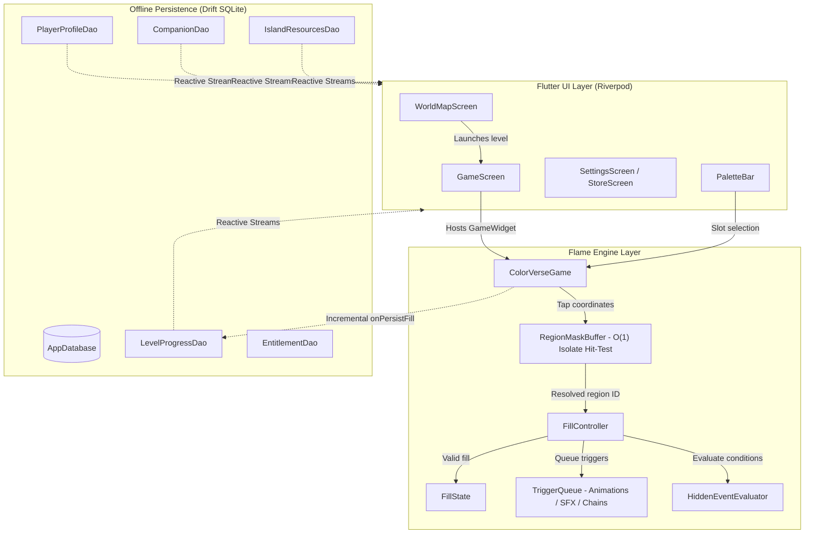

# 🎨 ColorVerse

> **A modern mobile coloring-adventure game crafted with Flutter and Flame.**  
> Blending relaxing tap-to-color mechanics with interactive world progression, dynamic Rive animations, companion evolution, and island building.

---

[](https://flutter.dev)
[](https://dart.dev)
[](https://flame-engine.org)
[](https://riverpod.dev)
[](https://drift.simonbinder.eu/)
[](https://github.com/Shanjai110603/ColorVerse)
[](#license)

---

## 🌟 Overview

**ColorVerse** transforms traditional digital coloring into an immersive, reactive adventure. As players fill in intricate illustrations, artwork comes alive through real-time animations, cascading chain reactions, atmospheric soundscapes, and hidden story events.

Players earn experience, collect biomes resources, unlock mythical companions, and build out their personal islands—all backed by a robust offline-first architecture designed for rock-solid performance and zero progress loss.

---

## ✨ Key Features

- **⚡ O(1) Pixel-Accurate Tap Detection**: Custom `RegionMaskBuffer` decoding offline-generated ID masks in pure Dart isolates for sub-millisecond tap resolution without UI stutters.
- **🎬 Dynamic Triggers & Cascades**:
  - **Animation Triggers**: Plays procedural Rive vector animations anchored to region centroids.
  - **SFX Triggers**: Spatial and situational sound effects dynamically triggered upon filling.
  - **Chain Reactions**: Domino-effect auto-fills that cascade across adjacent regions with configurable delays.
- **🔍 Secret Discoveries & Hidden Events**: In-game rule engine evaluating conditions (`allRegionsFilled`, `anyRegionFilled`, speed challenges) to unveil hidden sprites and narrative secrets.
- **🌍 Biome-Based World Progression**: Multi-tier world map (Enchanted Forest, Crystal Peaks, etc.) driven by a declarative `worlds.json` manifest.
- **🐾 Companions & Island Builder**:
  - Collect and evolve companions through multi-stage growth.
  - Gather world resources (Wood, Stone, Crystal, Food, Gold) to expand and build custom islands.
- **♿ Accessibility-First Design**: Built-in **Colorblind Mode** overlaying distinct geometric pattern symbols on palette slots and uncolored regions.
- **💾 Bulletproof Incremental Persistence**: High-throughput SQLite integration with Drift that saves progress on every single tap—guaranteeing no lost work if the app is closed mid-level.
- **🛠️ Built-in Level Authoring Suite**: Standalone desktop app (`tools/level_editor`) with automated region detection, mask generation, trigger chaining, and one-click JSON exporting.

---

## 🏗️ Architecture & Data Flow

ColorVerse follows a clean, reactive architecture separating the **Flutter UI layer**, the **Flame Game Engine**, and the **Drift SQLite Data Layer** via **Riverpod**:



---

## 📦 Project Structure

```
ColorVerse/
├── assets/
│   ├── sample_levels/             # Level packages (line art, mask PNG, level.json)
│   │   └── forest_01/
│   │       └── level.json
│   └── worlds.json                # Biomes, levels, unlocking criteria & requirements
├── lib/
│   ├── animations/                # Trigger queues, Rive handlers & hidden event evaluator
│   │   ├── hidden_event_evaluator.dart
│   │   ├── trigger_effect_component.dart
│   │   └── trigger_queue.dart
│   ├── audio/                     # Sound effects & background music manager
│   │   └── audio_manager.dart
│   ├── coloring/                  # Fill validation logic & interactive palette widgets
│   │   ├── fill_controller.dart
│   │   └── palette_bar.dart
│   ├── core/                      # Global providers, progression controllers & haptics
│   │   ├── haptics.dart
│   │   ├── progression_controller.dart
│   │   └── providers.dart
│   ├── engine/                    # Flame game instance & isolate-powered level loader
│   │   ├── colorverse_game.dart
│   │   └── level_loader.dart
│   ├── models/                    # Freezed & JSON serializable game definitions
│   │   ├── hidden_event_definition.dart
│   │   ├── level_definition.dart
│   │   ├── region_definition.dart
│   │   ├── reward_bundle.dart
│   │   ├── trigger_definition.dart
│   │   └── world_manifest.dart
│   ├── rendering/                 # Render components (line art, fill overlays, mask buffer)
│   │   ├── colorblind_overlay.dart
│   │   ├── fill_state.dart
│   │   ├── line_art_component.dart
│   │   └── region_mask_buffer.dart
│   ├── storage/                   # Drift SQLite schema, migrations, connection & DAOs
│   │   ├── database.dart
│   │   ├── tables.dart
│   │   └── daos/                  # Player, Level, Companion, Island & Entitlement DAOs
│   ├── ui/                        # Flutter presentation layer & screens
│   │   ├── game_screen.dart
│   │   ├── level_card.dart
│   │   ├── settings_screen.dart
│   │   ├── store_screen.dart
│   │   └── world_map_screen.dart
│   └── main.dart                  # App bootstrap with Riverpod ProviderScope
├── test/                          # Comprehensive game engine & storage test suites
└── tools/
    └── level_editor/              # Standalone Desktop Authoring Tool
        ├── lib/
        │   ├── editor/            # Region detection, mask encoding, import/export
        │   ├── ui/                # Canvas viewport, property panels, trigger builder
        │   └── utils/             # Color parsing and image encoding utilities
        └── test/                  # Tool verification & encoder tests
```

---

## 🛠️ Tech Stack & Dependencies

| Library / Tool | Purpose |
|---|---|
| **[Flutter](https://flutter.dev)** | Cross-platform client framework (Android, iOS, Desktop, Web) |
| **[Flame](https://flame-engine.org)** | 2D game engine powering the interactive canvas and component pipeline |
| **[Riverpod](https://riverpod.dev)** | Compile-safe, testable state management and dependency injection |
| **[Drift](https://drift.simonbinder.eu)** | Type-safe reactive SQLite persistence with stream subscriptions |
| **[Rive](https://rive.app)** | Real-time vector animation runtime for triggers and hidden reveals |
| **[Flame Audio](https://pub.dev/packages/flame_audio)** | Audio playback for SFX triggers and ambient world tracks |
| **[Image (Pure Dart)](https://pub.dev/packages/image)** | Isolate-safe image manipulation and mask buffer decoding |
| **[Freezed](https://pub.dev/packages/freezed)** | Immutable, union-type data modeling and JSON serialization |

---

## 🎨 Level Design & Mask Specification

ColorVerse achieves instant $O(1)$ tap hit testing using an encoded 24-bit ID mask:

$$\text{Region ID } n \implies \text{RGB}(0,\, n \gg 8,\, n \ \&\ 0\text{xFF})$$

- **Channel R**: Fixed to `0`
- **Channel G**: High byte (`n >> 8`)
- **Channel B**: Low byte (`n & 0xFF`)
- **Background / Line Borders**: Encoded as `0x000000` (Region `0`, ignored by tap handler).

### Sample `level.json` Snippet

```json
{
  "levelId": "forest_01",
  "displayName": "Whispering Grove",
  "world": "forest",
  "lineArt": "forest_01_lineart.png",
  "regionMask": "forest_01_regionmask.png",
  "regionCount": 214,
  "difficulty": "easy",
  "regions": [
    {
      "id": 14,
      "targetColor": "#3B7A45",
      "paletteSlot": 3,
      "onFillTriggers": [
        { "type": "animation", "asset": "leaves_grow.riv", "anchor": "region_centroid" },
        { "type": "sfx", "asset": "leaf_rustle.ogg" },
        { "type": "chain", "targetRegionId": 22, "delayMs": 800 }
      ]
    }
  ],
  "hiddenEvents": [
    {
      "id": "fairy_reveal",
      "condition": { "type": "allRegionsFilled", "regionIds": [14, 22, 31] },
      "reveal": { "type": "spriteReveal", "asset": "hidden_fairy.riv", "position": [0.62, 0.31] }
    }
  ]
}
```

---

## 🖌️ Desktop Level Editor (`tools/level_editor`)

ColorVerse includes a bespoke desktop authoring utility located in `tools/level_editor/`:

- **Automatic Region Detection**: Upload line art and colored reference images; the editor automatically segments discrete regions via flood-fill and boundary traversal.
- **Mask Encoder**: Automatically generates the RGB ID-mask PNG according to the engine specification.
- **Centroid & Bounding Calculation**: Automatically pinpoints exact geometric coordinates for anchoring Rive animations.
- **Interactive Trigger & Secret Editor**: Visually chain regions, set SFX timings, and define multi-region hidden events.
- **Integrity Validation**: Catches circular chains, missing assets, and unassigned palette slots before exporting.

To run the level editor on desktop:

```bash
cd tools/level_editor
flutter pub get
flutter run -d windows # or macos / linux
```

---

## 🚀 Getting Started

### Prerequisites

- [Flutter SDK](https://flutter.dev/docs/get-started/install) (`^3.10.7` or later)
- Dart SDK (`^3.10.7`)
- Target platform setup (Android Studio, Xcode, or Windows C++ build tools)

### 1. Clone the Repository

```bash
git clone https://github.com/Shanjai110603/ColorVerse.git
cd ColorVerse
```

### 2. Install Dependencies

```bash
flutter pub get
```

### 3. Generate Code (Models & Drift Database)

If modifying models or tables, re-generate Drift and Freezed sources:

```bash
dart run build_runner build --delete-conflicting-outputs
```

### 4. Run the Game

```bash
flutter run
```

---

## 🧪 Running Tests

ColorVerse includes extensive unit and integration tests with **100% test pass rate** across core systems:

```bash
# Run core game engine & storage tests (98+ tests)
flutter test

# Run level editor authoring tests (21+ tests)
cd tools/level_editor
flutter test
```

Test coverage includes:
- `DriftDaoTest`: Profile seeding, currency transactions, level progress tracking, companion evolution, and entitlement validation.
- `RegionMaskBufferTest`: Isolate PNG decoding, high-ID region bitwise decoding, boundary validation.
- `HiddenEventEvaluatorTest`: Condition evaluations (`allRegionsFilled`, `anyRegionFilled`, time limits).
- `TriggerQueueTest`: Concurrency caps, cancellation, and cascading chains.
- `LevelExporterTest`: Cyclic chain validation, missing reference detection, and level integrity.

---

## 🤝 Contributing

Contributions, issues, and feature requests are welcome! Feel free to check the issues tab or submit a PR.

1. Fork the Project
2. Create your Feature Branch (`git checkout -b feature/AmazingFeature`)
3. Commit your Changes (`git commit -m 'Add some AmazingFeature'`)
4. Push to the Branch (`git push origin feature/AmazingFeature`)
5. Open a Pull Request

---

## 📄 License

Distributed under the MIT License. See `LICENSE` for more information.
